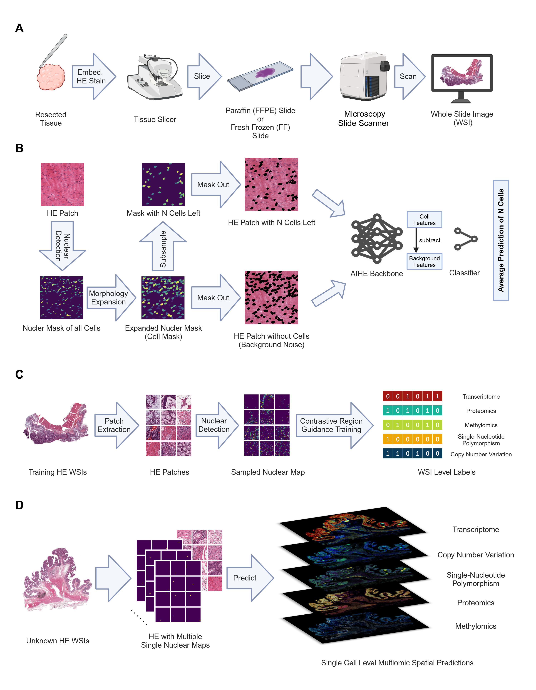

# AIHE: An artificial intelligence platform for predicting spatial single-cell multi-omics quantitative data based on hematoxylin-eosin staining images

This repository contains the original **PyTorch** implementation of **AIHE,** an approach to predict single-cell spatial multi-omics from HE-stained whole slide images (WSI).



## Features

* [x] Nuclear Detection
* [x] Multi-omics Single-Cell Prediction
* [x] Downstream Analysis
* [ ] Heatmap Visulization

## Set Up Environment

To run this code set up python environment as follows:

```
git clone https://github.com/BioinforCloud/AIHE.git
cd AIHE
conda env create -f requirements.txt
```

We tested our code with `Python 3.10` and `Cuda 12`.


## Running the Code

### Data Preparation

Download the pre-trained model weights folder from the shared link [here](https://drive.google.com/file/d/1SbSArI3KOOWHxRlxnjchO7_MbWzB4lNR/view?pli=1) and place it in the AIHE upper level directory with the following prepared file structure:

- `AIHE/`
- `model_weights/`


### Nuclear Detection

Follow the guidelines in the notebook below to load the WSI file (.svs format) and export the whole cell nucleus detection mask (nulci.png) and save it where you need it:

```
nuclear_detection.ipynb
```

### Single-cell Spatial Multi-omics Prediction

Following the guidelines in the notebook below, input the WSI file (.svs format), as well as the whole cell nucleus detection mask (nulci.png) and perform multi-omics predictions, output the expression of each cell with spatial coordinates, and save as a csv file.

```
singe_cell_prediction.ipynb
```


## License

This project is licensed under the APACHE License 2.0 - see the [LICENSE](LICENSE) file for details. 

Note that the PanNuke dataset is licensed under [Attribution-NonCommercial-ShareAlike 4.0 International](http://creativecommons.org/licenses/by-nc-sa/4.0/), therefore the derived weights for HoVer-UNet and pre-processed PanNuke dataset to train HoVer-UNet are also shared under the same license. Please consider the implications of using the weights under this license on your work, and it's licensing. 
